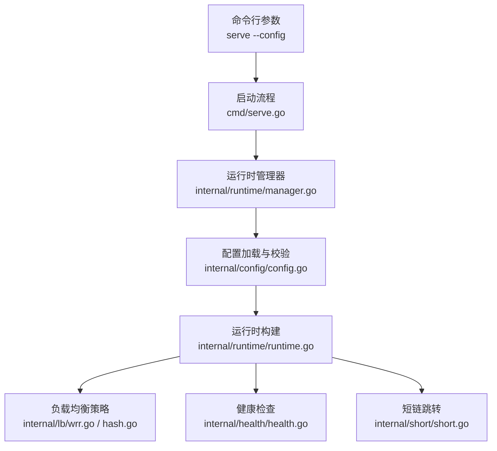
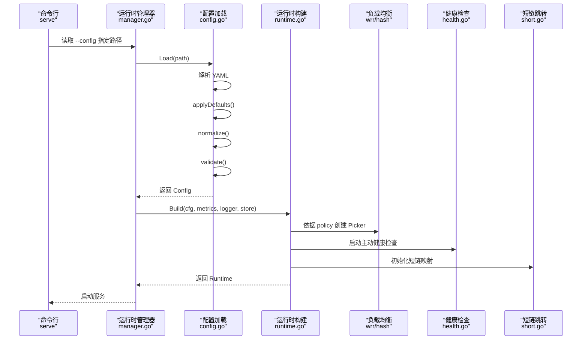
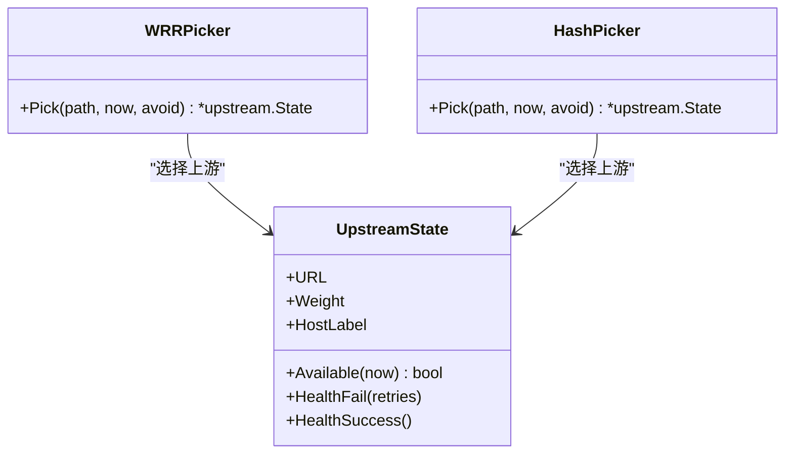
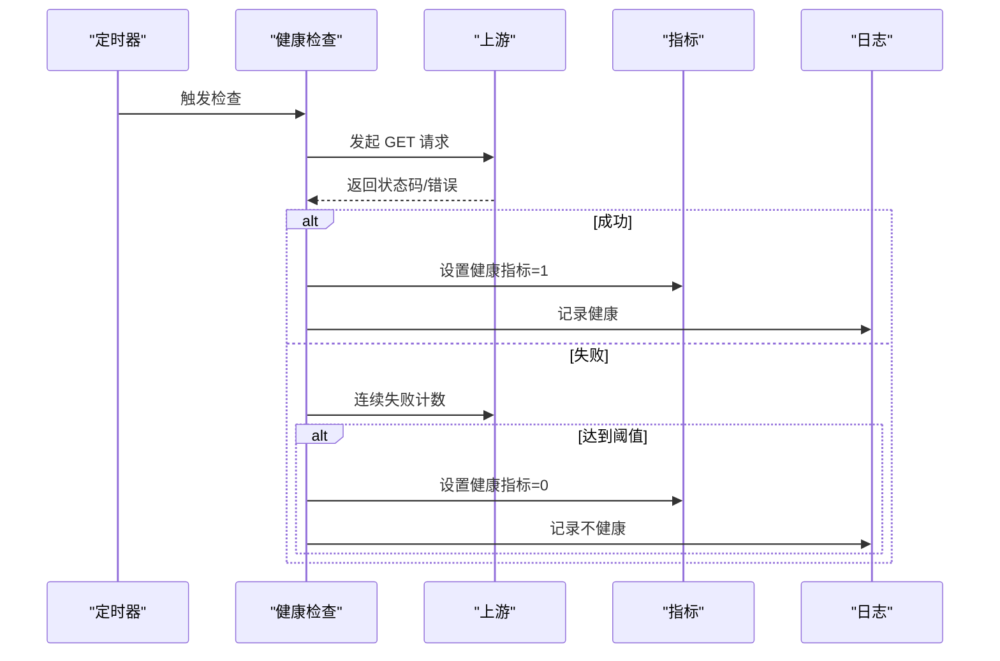
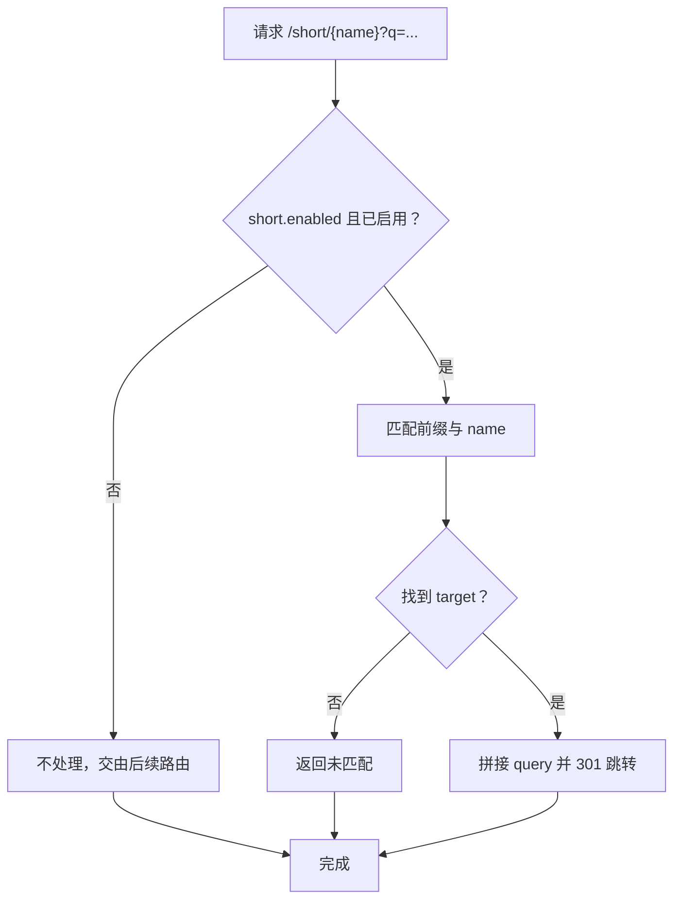
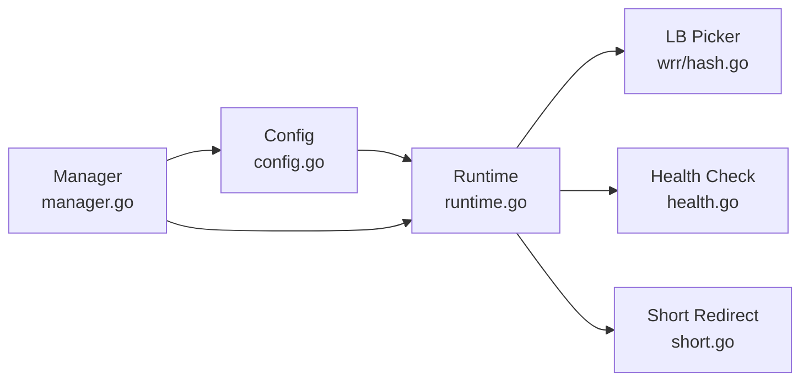

# 配置详解

<cite>
**本文引用的文件**
- [config.example.yaml](file://config.example.yaml)
- [config.go](file://internal/config/config.go)
- [manager.go](file://internal/runtime/manager.go)
- [runtime.go](file://internal/runtime/runtime.go)
- [wrr.go](file://internal/lb/wrr.go)
- [hash.go](file://internal/lb/hash.go)
- [health.go](file://internal/health/health.go)
- [short.go](file://internal/short/short.go)
- [serve.go](file://cmd/serve.go)
</cite>

## 目录
1. [简介](#简介)
2. [项目结构](#项目结构)
3. [核心组件](#核心组件)
4. [架构总览](#架构总览)
5. [详细组件分析](#详细组件分析)
6. [依赖分析](#依赖分析)
7. [性能考虑](#性能考虑)
8. [故障排查指南](#故障排查指南)
9. [结论](#结论)
10. [附录](#附录)

## 简介
本文件围绕 RSSHub-Gateway 的配置系统进行深入解析，重点覆盖以下方面：
- 逐层解读 config.example.yaml 的结构与语义：server、gateway_auth、metrics、pprof、short、routing、failover、groups、short.entries 等。
- 对照 internal/config/config.go 中的结构体定义，解释配置加载、解析、默认值填充、规范化与校验的实现机制。
- 提供典型配置场景示例：多分组路由、WRR 负载均衡、健康检查参数调优等。
- 指出常见配置错误与排查方法，帮助避免因配置不当导致的服务异常。

## 项目结构
配置系统涉及的关键文件与职责如下：
- 配置样例：config.example.yaml
- 配置模型与加载：internal/config/config.go
- 运行时构建与热重载：internal/runtime/manager.go、internal/runtime/runtime.go
- 负载均衡策略：internal/lb/wrr.go、internal/lb/hash.go
- 健康检查：internal/health/health.go
- 短链跳转：internal/short/short.go
- 启动入口与配置路径：cmd/serve.go

图表来源
- [serve.go](file://cmd/serve.go#L18-L66)
- [manager.go](file://internal/runtime/manager.go#L28-L67)
- [config.go](file://internal/config/config.go#L145-L160)
- [runtime.go](file://internal/runtime/runtime.go#L50-L127)
- [wrr.go](file://internal/lb/wrr.go#L1-L51)
- [hash.go](file://internal/lb/hash.go#L1-L49)
- [health.go](file://internal/health/health.go#L16-L43)
- [short.go](file://internal/short/short.go#L1-L35)

章节来源
- [serve.go](file://cmd/serve.go#L18-L66)

## 核心组件
本节对配置文件中的关键块进行逐层解析，并结合结构体定义说明其作用、合法取值与相互关系。

- server
  - 字段：listen、timeout_ms
  - 作用：监听地址与请求超时时间
  - 合法取值：listen 必须为有效地址字符串；timeout_ms 必须大于 0
  - 相互关系：与 runtime.Server 一致，用于 Fiber 服务器启动
  - 章节来源
    - [config.go](file://internal/config/config.go#L25-L28)
    - [config.go](file://internal/config/config.go#L394-L396)
    - [runtime.go](file://internal/runtime/runtime.go#L104-L118)

- gateway_auth
  - 字段：enabled、access_key、accept_key、accept_code、bypass_paths
  - 作用：网关鉴权开关、全局访问密钥、支持的鉴权方式、白名单路径
  - 合法取值：当 enabled=true 时，access_key 必填；至少 accept_key 或 accept_code 之一为真；bypass_paths 经规范化处理
  - 相互关系：与 runtime.Auth 一致，影响代理层鉴权逻辑
  - 章节来源
    - [config.go](file://internal/config/config.go#L30-L36)
    - [config.go](file://internal/config/config.go#L321-L329)
    - [config.go](file://internal/config/config.go#L248-L257)

- metrics
  - 字段：enabled、path、accesskey
  - 作用：Prometheus 指标开关、指标暴露路径、访问密钥
  - 合法取值：enabled=true 时，path 必须以 “/” 开头且非空；accesskey 必填
  - 相互关系：与 runtime.Metrics 一致，用于指标服务
  - 章节来源
    - [config.go](file://internal/config/config.go#L38-L42)
    - [config.go](file://internal/config/config.go#L330-L345)
    - [config.go](file://internal/config/config.go#L248-L251)

- pprof
  - 字段：enabled、path、accesskey
  - 作用：pprof 调试端点开关、路径、访问密钥
  - 合法取值：enabled=true 时，path 必须以 “/” 开头且非空；accesskey 必填
  - 相互关系：与 runtime.Pprof 一致，用于调试
  - 章节来源
    - [config.go](file://internal/config/config.go#L44-L48)
    - [config.go](file://internal/config/config.go#L338-L345)
    - [config.go](file://internal/config/config.go#L248-L251)

- short
  - 字段：enabled、path、entries
  - 作用：短订阅跳转开关、短链前缀路径、短链条目
  - entries 子字段：name、target
  - 合法取值：enabled=true 时，path 必须以 “/” 开头且非空；entries 名称唯一且非空；target 支持 https 或特定前缀的内部路径
  - 相互关系：与 runtime.Short 一致，用于 301 跳转并透传 query
  - 章节来源
    - [config.go](file://internal/config/config.go#L78-L88)
    - [config.go](file://internal/config/config.go#L373-L390)
    - [config.go](file://internal/config/config.go#L466-L476)
    - [short.go](file://internal/short/short.go#L19-L35)

- routing
  - 字段：default_group
  - 作用：默认分组名
  - 合法取值：default_group 必须存在且在 groups 中
  - 相互关系：与 runtime.DefaultGroup 一致，用于路由选择
  - 章节来源
    - [config.go](file://internal/config/config.go#L89-L91)
    - [config.go](file://internal/config/config.go#L391-L393)
    - [runtime.go](file://internal/runtime/runtime.go#L104-L118)

- failover
  - 字段：retry、passive_eject
  - retry：enabled、max_retries
  - passive_eject：enabled、fail_threshold、base_eject_ms、max_eject_ms
  - 作用：重试策略与被动剔除策略
  - 合法取值：max_retries≥1；fail_threshold≥1；base_eject_ms≤max_eject_ms
  - 相互关系：与 runtime.Failover 一致，影响上游可用性与重试行为
  - 章节来源
    - [config.go](file://internal/config/config.go#L93-L108)
    - [config.go](file://internal/config/config.go#L397-L400)
    - [config.go](file://internal/config/config.go#L209-L220)

- groups
  - 字段：name、backend、strip_prefix、priority、allow、deny、lb、fallback_groups、health、upstreams
  - 合法取值与规则：
    - name 非空且唯一
    - backend 取值 rsshub 或 upvote，默认 rsshub
    - strip_prefix 以 “/” 开头（自动补全），为空或以 “/” 开头均可
    - priority 数值越大优先级越高
    - allow/deny 为前缀列表，前缀必须以 “/” 开头
    - lb.policy 取值 wrr 或 hash，默认 wrr
    - fallback_groups 引用的组必须存在且不可自引用
    - 至少一个 upstream
    - upstream.url 必须为 http/https 且 scheme 正确，weight>0；backend=rsshub 时要求 access_key
    - health.active.enabled=true 时，interval_ms、timeout_ms、retries 合法
  - 相互关系：与 runtime.Groups 一致，决定路由匹配、负载均衡、健康检查与回退策略
  - 章节来源
    - [config.go](file://internal/config/config.go#L110-L144)
    - [config.go](file://internal/config/config.go#L401-L464)
    - [runtime.go](file://internal/runtime/runtime.go#L50-L127)

- short.entries
  - 字段：name、target
  - 合法取值：name 非空且唯一；target 支持 https 或 /rsshub、/upvote 前缀
  - 相互关系：与 short.Runtime.Targets 映射一致
  - 章节来源
    - [config.go](file://internal/config/config.go#L84-L87)
    - [config.go](file://internal/config/config.go#L466-L476)
    - [short.go](file://internal/short/short.go#L19-L35)

## 架构总览
配置加载与运行时构建的总体流程如下：

图表来源
- [serve.go](file://cmd/serve.go#L18-L66)
- [manager.go](file://internal/runtime/manager.go#L28-L67)
- [config.go](file://internal/config/config.go#L145-L160)
- [runtime.go](file://internal/runtime/runtime.go#L50-L127)
- [wrr.go](file://internal/lb/wrr.go#L1-L51)
- [hash.go](file://internal/lb/hash.go#L1-L49)
- [health.go](file://internal/health/health.go#L16-L43)
- [short.go](file://internal/short/short.go#L1-L18)

## 详细组件分析

### 配置加载与校验流程
- 加载阶段
  - 读取文件 -> 解析 YAML -> 应用默认值 -> 规范化 -> 校验
- 默认值填充
  - 多处字段提供默认值，如 server.listen、server.timeout_ms、metrics.path、pprof.path、short.path、缓存相关、重试与被动剔除阈值、组默认 backend 与 lb.policy、健康检查默认路径与周期等
- 规范化
  - 路径统一以 “/” 开头并去除尾部斜杠；允许/拒绝前缀统一标准化；短链条目名称与目标去空白；组 strip_prefix 自动补前导 “/”
- 校验
  - 关键约束包括：鉴权必填项、指标与 pprof 路径合法性、缓存 provider 与参数范围、短链条目唯一性与格式、路由默认组存在性、组名唯一与回退组有效性、上游 URL 与权重、健康检查参数、被动剔除上下界等

图表来源
- [config.go](file://internal/config/config.go#L145-L160)
- [config.go](file://internal/config/config.go#L162-L246)
- [config.go](file://internal/config/config.go#L248-L320)
- [config.go](file://internal/config/config.go#L321-L464)

章节来源
- [config.go](file://internal/config/config.go#L145-L160)
- [config.go](file://internal/config/config.go#L162-L246)
- [config.go](file://internal/config/config.go#L248-L320)
- [config.go](file://internal/config/config.go#L321-L464)

### 负载均衡策略
- WRR（加权轮询）
  - 基于权重累加与总权重归一化选择上游
  - 适用于流量均匀分布与权重调整场景
- Hash（一致性哈希）
  - 基于路径与上游标签计算得分，权重参与评分
  - 适用于需要会话粘性或路径一致性场景

图表来源
- [wrr.go](file://internal/lb/wrr.go#L1-L51)
- [hash.go](file://internal/lb/hash.go#L1-L49)

章节来源
- [wrr.go](file://internal/lb/wrr.go#L1-L51)
- [hash.go](file://internal/lb/hash.go#L1-L49)
- [runtime.go](file://internal/runtime/runtime.go#L68-L88)

### 健康检查
- 主动健康检查
  - 定时轮询上游健康路径，支持超时与重试
  - 当连续失败达到阈值，标记为不健康；恢复后标记为健康
  - 通过指标与日志记录状态变化
- 参数要点
  - enabled=true 时，path、interval_ms、timeout_ms、retries 合法
  - 健康检查 URL 自动拼接 ?key=access_key

图表来源
- [health.go](file://internal/health/health.go#L16-L43)
- [health.go](file://internal/health/health.go#L45-L78)
- [health.go](file://internal/health/health.go#L98-L115)
- [runtime.go](file://internal/runtime/runtime.go#L120-L124)

章节来源
- [health.go](file://internal/health/health.go#L16-L43)
- [health.go](file://internal/health/health.go#L45-L78)
- [health.go](file://internal/health/health.go#L98-L115)
- [runtime.go](file://internal/runtime/runtime.go#L120-L124)

### 短链跳转
- 功能
  - 将 /short/{name} 重定向至对应 target，并透传原始 query
- 匹配规则
  - 路径前缀匹配；name 不能为空且唯一
- 目标限制
  - 支持 https 外链或 /rsshub、/upvote 前缀的内部路径

图表来源
- [short.go](file://internal/short/short.go#L19-L35)
- [config.go](file://internal/config/config.go#L373-L390)

章节来源
- [short.go](file://internal/short/short.go#L19-L35)
- [config.go](file://internal/config/config.go#L373-L390)

### 典型配置场景示例
- 多分组路由
  - 在 groups 中定义多个组，分别设置 allow/deny 前缀与 strip_prefix，利用 priority 控制前缀长度相同时的优先级
  - 使用 fallback_groups 实现回退策略
  - 参考路径
    - [config.example.yaml](file://config.example.yaml#L129-L212)
    - [config.go](file://internal/config/config.go#L110-L144)
    - [runtime.go](file://internal/runtime/runtime.go#L50-L97)

- WRR 负载均衡设置
  - 在组内将 lb.policy 设为 wrr，并为每个 upstream 设置 weight
  - 参考路径
    - [config.example.yaml](file://config.example.yaml#L146-L181)
    - [config.go](file://internal/config/config.go#L123-L126)
    - [wrr.go](file://internal/lb/wrr.go#L1-L51)

- 健康检查参数调优
  - 调整 health.active.interval_ms、timeout_ms、retries，确保在高延迟网络下仍能稳定探测
  - 参考路径
    - [config.example.yaml](file://config.example.yaml#L153-L170)
    - [config.go](file://internal/config/config.go#L131-L137)
    - [health.go](file://internal/health/health.go#L16-L43)

- 短链跳转
  - 启用 short.enabled，设置 short.path，添加 entries.name 与 entries.target
  - 参考路径
    - [config.example.yaml](file://config.example.yaml#L62-L80)
    - [config.go](file://internal/config/config.go#L78-L88)
    - [short.go](file://internal/short/short.go#L19-L35)

## 依赖分析
- 配置到运行时的依赖
  - Config 结构体字段与 Runtime 字段一一对应，构建时将 Config 转换为运行时对象
  - 负载均衡与健康检查依赖上游状态集合
- 组件耦合
  - runtime.Build 依赖 config 的 Groups、Routing、Failover、Server 等
  - manager 通过 FileHash 与自动重载循环实现配置热更新
- 外部依赖
  - YAML 解析、FastHTTP 客户端、Zap 日志、指标库

图表来源
- [config.go](file://internal/config/config.go#L12-L23)
- [runtime.go](file://internal/runtime/runtime.go#L19-L49)
- [wrr.go](file://internal/lb/wrr.go#L1-L51)
- [hash.go](file://internal/lb/hash.go#L1-L49)
- [health.go](file://internal/health/health.go#L16-L43)
- [short.go](file://internal/short/short.go#L1-L18)
- [manager.go](file://internal/runtime/manager.go#L28-L67)

章节来源
- [config.go](file://internal/config/config.go#L12-L23)
- [runtime.go](file://internal/runtime/runtime.go#L19-L49)
- [manager.go](file://internal/runtime/manager.go#L28-L67)

## 性能考虑
- 负载均衡
  - WRR 适合均匀分布；Hash 适合路径一致性需求
  - 权重设置应与上游容量匹配，避免过载
- 健康检查
  - interval_ms 与 timeout_ms 需平衡探测频率与网络开销
  - retries 过小易误判，过大可能放大抖动
- 缓存
  - 合理设置 TTL 与内存/Redis 参数，避免缓存击穿或内存溢出
- 短链
  - entries 数量不宜过多，避免匹配开销增大

## 故障排查指南
- 常见错误与定位
  - 鉴权配置缺失：当 gateway_auth.enabled=true 时，若 access_key 为空或 accept_key/accept_code 均为 false，将报错
    - 参考路径
      - [config.go](file://internal/config/config.go#L321-L329)
  - 指标/调试路径非法：metrics.path 或 pprof.path 不以 “/” 开头或为空，将报错
    - 参考路径
      - [config.go](file://internal/config/config.go#L330-L345)
  - 短链配置非法：short.path 不合法或 entries.name 重复/为空，或 target 格式不被允许
    - 参考路径
      - [config.go](file://internal/config/config.go#L373-L390)
      - [config.go](file://internal/config/config.go#L466-L476)
  - 路由默认组不存在：routing.default_group 未在 groups 中出现
    - 参考路径
      - [config.go](file://internal/config/config.go#L391-L393)
  - 组配置错误：组名重复、strip_prefix 非法、lb.policy 非法、upstreams 为空、上游 URL/权重非法、backend=rsshub 但缺少 access_key
    - 参考路径
      - [config.go](file://internal/config/config.go#L401-L464)
  - 被动剔除边界错误：base_eject_ms > max_eject_ms
    - 参考路径
      - [config.go](file://internal/config/config.go#L397-L400)
- 排查步骤建议
  - 逐步注释 groups 中的组，确认是否为某组配置导致问题
  - 检查 upstreams 的 URL 与 scheme 是否正确
  - 使用最小化配置复现问题，再逐步增加复杂度
  - 查看日志与指标，关注健康检查失败与上游可用性变化

章节来源
- [config.go](file://internal/config/config.go#L321-L464)

## 结论
配置系统通过严格的默认值填充、规范化与校验，确保了配置的一致性与安全性。结合多分组路由、WRR/Hash 负载均衡与健康检查，能够灵活地满足不同业务场景的需求。遵循本文提供的配置规范与排障建议，可显著降低配置错误带来的服务异常风险。

## 附录
- 配置文件位置与加载
  - 通过命令行参数 --config 指定配置文件路径
  - 启动时由 manager 调用 config.Load 完成加载与校验
  - 参考路径
    - [serve.go](file://cmd/serve.go#L63-L66)
    - [manager.go](file://internal/runtime/manager.go#L28-L67)
    - [config.go](file://internal/config/config.go#L145-L160)