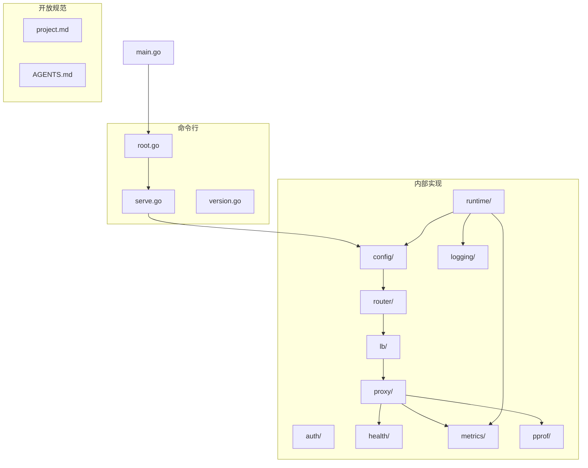
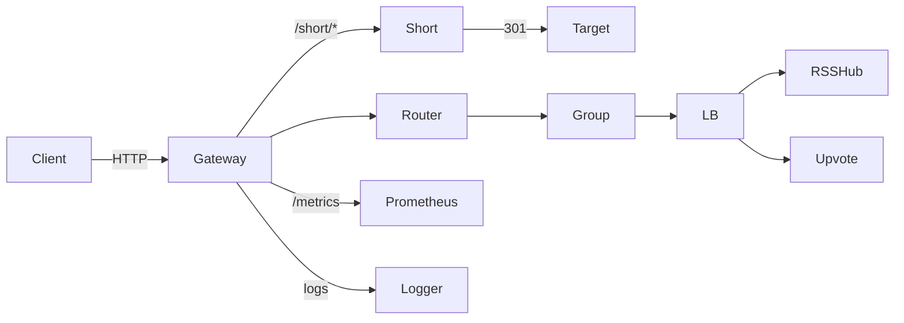
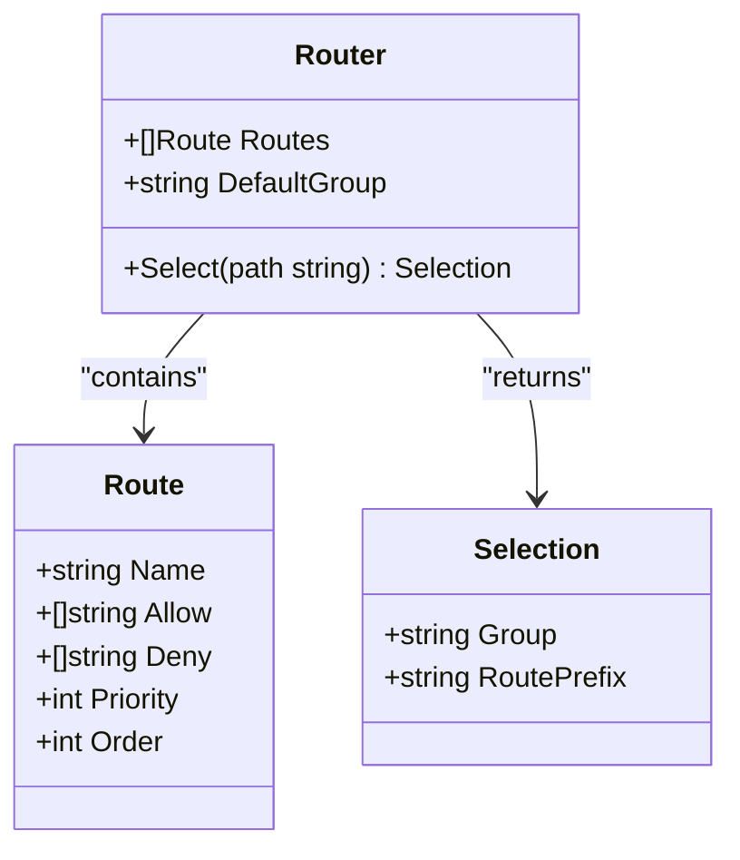
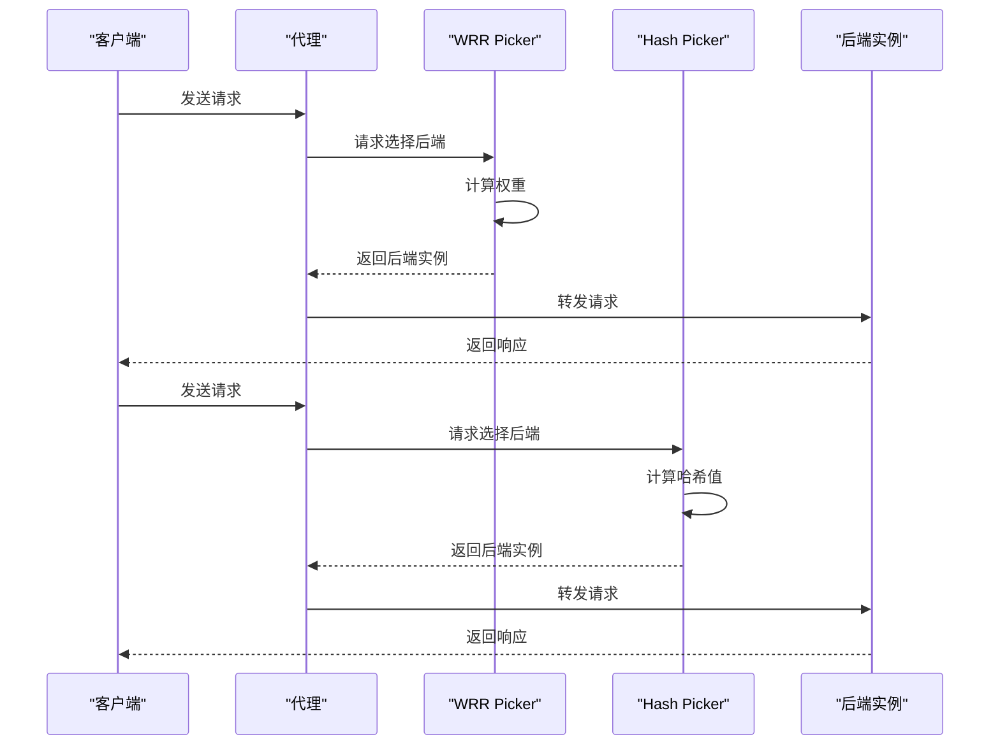
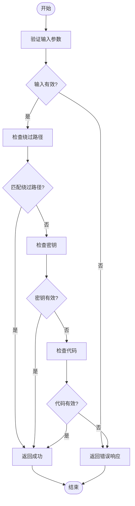
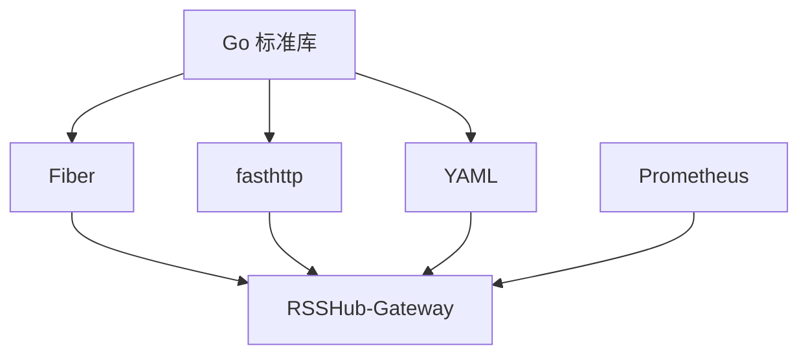

# 项目概述

<cite>
**本文档引用的文件**
- [README.md](file://README.md)
- [project.md](file://openspec/project.md)
- [main.go](file://main.go)
- [config.go](file://internal/config/config.go)
- [router.go](file://internal/router/router.go)
- [wrr.go](file://internal/lb/wrr.go)
- [hash.go](file://internal/lb/hash.go)
- [auth.go](file://internal/auth/auth.go)
- [proxy.go](file://internal/proxy/proxy.go)
- [health.go](file://internal/health/health.go)
- [metrics.go](file://internal/metrics/metrics.go)
- [manager.go](file://internal/runtime/manager.go)
</cite>

## 目录
1. [简介](#简介)
2. [项目结构](#项目结构)
3. [核心组件](#核心组件)
4. [架构概述](#架构概述)
5. [详细组件分析](#详细组件分析)
6. [依赖分析](#依赖分析)
7. [性能考虑](#性能考虑)
8. [故障排除指南](#故障排除指南)
9. [结论](#结论)

## 简介
RSSHub-Gateway 是一个高性能的反向代理网关，专为 RSSHub 生态系统设计。它通过路由、负载均衡、鉴权和可观测性等关键特性，确保在高负载下保持 RSSHub 和 Upvote RSS 的稳定性。该项目采用 Go 语言开发，结合 Fiber 和 fasthttp 框架，优化了低延迟代理性能。其设计目标是提供一个稳定且兼容 RSSHub 的入口点，支持多后端路由、主动健康检查、被动剔除、重试和回退机制，并具备 Prometheus 指标、pprof 性能分析和 JSON 日志记录功能。

**Section sources**
- [README.md](file://README.md#L1-L361)
- [project.md](file://openspec/project.md#L1-L60)

## 项目结构
RSSHub-Gateway 的项目结构清晰地划分为多个模块，每个模块负责特定的功能。主要目录包括 `cmd`（命令行接口）、`internal`（内部实现）和 `openspec`（开放规范）。`internal` 目录下进一步细分为 `auth`（鉴权）、`config`（配置管理）、`health`（健康检查）、`lb`（负载均衡）、`proxy`（代理逻辑）、`router`（路由）、`runtime`（运行时管理）等子模块。这种模块化设计使得代码易于维护和扩展。

**Diagram sources**
- [main.go](file://main.go#L1-L22)
- [cmd/root.go](file://cmd/root.go#L1-L30)
- [internal/config/config.go](file://internal/config/config.go#L1-L476)

**Section sources**
- [internal/config/config.go](file://internal/config/config.go#L1-L476)
- [internal/router/router.go](file://internal/router/router.go#L1-L80)

## 核心组件
RSSHub-Gateway 的核心组件包括配置管理、路由、负载均衡、鉴权、代理、健康检查和可观测性。这些组件协同工作，确保网关的高可用性和可维护性。配置管理模块负责加载和验证 YAML 配置文件；路由模块根据请求路径选择合适的后端组；负载均衡模块支持加权轮询（WRR）和哈希（Hash）策略；鉴权模块提供网关级别的访问控制；代理模块处理请求转发和响应；健康检查模块监控后端实例的健康状态；可观测性模块提供指标、日志和性能分析功能。

**Section sources**
- [internal/config/config.go](file://internal/config/config.go#L1-L476)
- [internal/router/router.go](file://internal/router/router.go#L1-L80)
- [internal/lb/wrr.go](file://internal/lb/wrr.go#L1-L51)
- [internal/lb/hash.go](file://internal/lb/hash.go#L1-L49)
- [internal/auth/auth.go](file://internal/auth/auth.go#L1-L58)
- [internal/proxy/proxy.go](file://internal/proxy/proxy.go#L1-L350)
- [internal/health/health.go](file://internal/health/health.go#L1-L115)
- [internal/metrics/metrics.go](file://internal/metrics/metrics.go#L1-L87)

## 架构概述
RSSHub-Gateway 的架构设计简洁高效，遵循单一入口原则，支持多后端路由和前缀分组。请求流程包括认证、路由选择、负载均衡和代理转发。网关通过主动健康检查和被动剔除机制确保后端服务的高可用性，同时支持 SIGHUP 信号触发的配置热重载，实现零停机更新。架构图展示了客户端请求如何通过网关到达后端服务，并返回响应。

**Diagram sources**
- [README.md](file://README.md#L38-L50)

## 详细组件分析

### 路由组件分析
路由组件是 RSSHub-Gateway 的核心之一，负责根据请求路径选择合适的后端组。它使用前缀匹配规则，优先级最高的最长前缀获胜。路由配置允许定义允许和拒绝的路径前缀，拒绝规则优先于允许规则。此外，路由还支持按优先级和配置顺序进行选择。

**Diagram sources**
- [internal/router/router.go](file://internal/router/router.go#L1-L80)

**Section sources**
- [internal/router/router.go](file://internal/router/router.go#L1-L80)

### 负载均衡组件分析
负载均衡组件支持两种策略：加权轮询（WRR）和哈希（Hash）。WRR 策略根据权重分配请求，确保高权重的后端实例接收更多请求。Hash 策略基于请求路径计算哈希值，确保相同路径的请求总是被路由到同一后端实例，提高缓存命中率。

**Diagram sources**
- [internal/lb/wrr.go](file://internal/lb/wrr.go#L1-L51)
- [internal/lb/hash.go](file://internal/lb/hash.go#L1-L49)

**Section sources**
- [internal/lb/wrr.go](file://internal/lb/wrr.go#L1-L51)
- [internal/lb/hash.go](file://internal/lb/hash.go#L1-L49)

### 鉴权组件分析
鉴权组件提供网关级别的访问控制，支持密钥（key）和代码（code）两种认证方式。密钥认证直接验证请求中的 `key` 参数，代码认证则通过 MD5 哈希算法验证 `code` 参数。此外，鉴权组件还支持绕过特定路径的认证，如静态资源文件。

**Diagram sources**
- [internal/auth/auth.go](file://internal/auth/auth.go#L1-L58)

**Section sources**
- [internal/auth/auth.go](file://internal/auth/auth.go#L1-L58)

## 依赖分析
RSSHub-Gateway 的依赖关系清晰，各模块之间耦合度低，便于独立开发和测试。核心依赖包括 Go 标准库、Fiber 框架、fasthttp 库、Prometheus 客户端库和 YAML 解析库。这些依赖项共同支持网关的各项功能，如 HTTP 请求处理、指标收集和配置解析。

**Diagram sources**
- [go.mod](file://go.mod#L1-L20)
- [internal/config/config.go](file://internal/config/config.go#L1-L476)

**Section sources**
- [go.mod](file://go.mod#L1-L20)
- [internal/config/config.go](file://internal/config/config.go#L1-L476)

## 性能考虑
RSSHub-Gateway 在设计上充分考虑了性能优化。使用 fasthttp 库替代标准 net/http 库，显著降低了内存分配和垃圾回收开销。负载均衡策略支持平滑加权轮询，避免了热点问题。健康检查机制减少了对故障后端的无效请求，提高了整体响应速度。此外，配置热重载功能避免了重启带来的服务中断，保证了高可用性。

## 故障排除指南
当遇到问题时，首先检查日志输出，特别是 JSON 格式的访问日志和事件日志。常见的问题包括配置错误、后端服务不可用和网络连接问题。可以通过 Prometheus 指标监控网关的请求量、延迟和错误率，使用 pprof 工具进行性能分析，定位瓶颈所在。如果需要调试，可以启用详细的日志级别，查看具体的请求处理过程。

**Section sources**
- [internal/logging/logging.go](file://internal/logging/logging.go#L1-L8)
- [internal/metrics/metrics.go](file://internal/metrics/metrics.go#L1-L87)
- [internal/pprof/pprof.go](file://internal/pprof/pprof.go#L1-L63)

## 结论
RSSHub-Gateway 作为一个高性能的反向代理网关，成功地解决了 RSSHub 生态系统中的高可用性和可维护性问题。通过模块化设计和配置驱动架构，它提供了灵活的路由、负载均衡、鉴权和可观测性功能。无论是运维工程师还是平台开发者，都能从中受益，实现稳定可靠的 RSS 服务。未来的发展方向可能包括多租户支持、更精细的访问控制和缓存机制，进一步提升系统的性能和安全性。