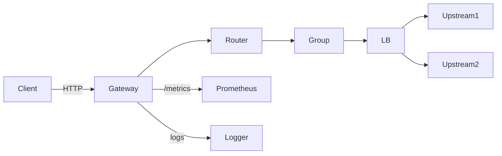
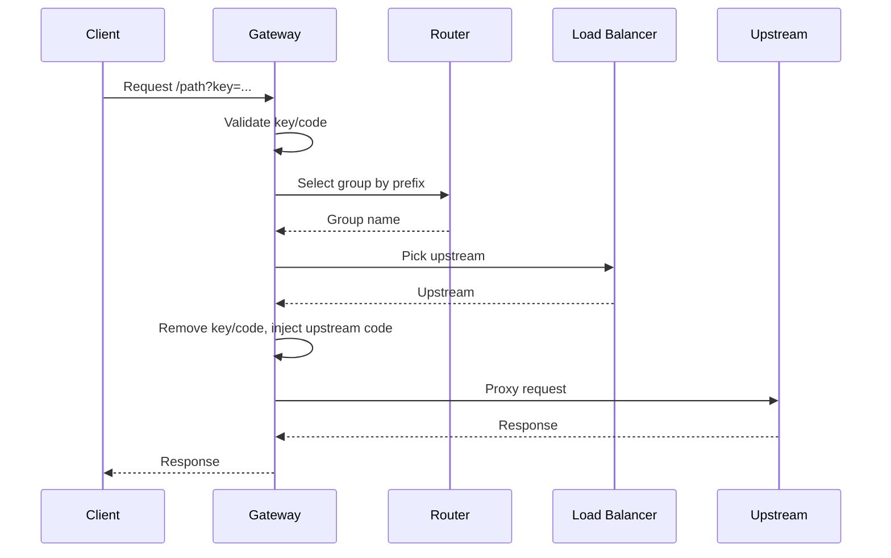

# RSSHub-Gateway

A simple, production-ready gateway for multi-instance RSSHub deployments. It provides
routing by prefix, per-group load balancing, health checks and failover, metrics, and
hot reload. The goal is to keep RSSHub compatibility while making operations safer.

- Language: Go
- Transport: Fiber + fasthttp
- Auth: gateway key/code + upstream code injection
- Observability: Prometheus + JSON logs

[中文说明](README_zh.md)

## Features
- Route by prefix with allow/deny rules and longest-prefix selection
- Load balancing per group: smooth WRR or hash(path)
- Gateway auth: `?key=` or `?code=md5(path+key)`
- Upstream auth injection: remove client key/code, inject upstream code
- Active health checks + passive eject + retry + fallback
- Prometheus metrics with access key
- JSON access and event logs
- SIGHUP config reload with rollback on failure

## Architecture





## Quickstart

```bash
# build
make build

# run
./rsshub-gateway serve -c config.example.yaml
```

## Docker

```bash
docker build -t rsshub-gateway:latest .
docker run --rm -p 8080:8080 rsshub-gateway:latest
```

Prebuilt images:
- `docker pull nerdneils/rsshub-gateway:latest`
- `docker pull ghcr.io/nerdneilsfield/rsshub-gateway:latest`

To use a custom config:

```bash
docker run --rm -p 8080:8080 \
  -v "$(pwd)/config.example.yaml:/app/config.yaml:ro" \
  rsshub-gateway:latest \
  /app/rsshub-gateway serve -c /app/config.yaml
```

## Configuration

The full schema lives in `config.example.yaml`.

<details>
<summary>How to write config (details)</summary>

- `routing.default_group` must match a group name.
- Prefix rules use `allow`/`deny` with leading `/`; deny overrides allow.
- `gateway_auth` needs `access_key` and at least one of `accept_key`/`accept_code`.
- Upstream `access_key` is required for code injection and healthcheck `?key=`.
- Health check uses `path`, `interval_ms`, `timeout_ms`, `retries`.
- `failover.passive_eject` requires `base_eject_ms <= max_eject_ms`.
- Metrics require `metrics.accesskey` when enabled.
</details>

<details>
<summary>Full config example</summary>

```yaml
server:
  listen: ":8080"
  timeout_ms: 8000

gateway_auth:
  enabled: true
  access_key: "ILoveRSSHub"
  accept_key: true
  accept_code: true

metrics:
  enabled: true
  path: "/metrics"
  accesskey: "PROM_KEY_123"

routing:
  default_group: "public"

failover:
  retry:
    enabled: true
    max_retries: 1
  passive_eject:
    enabled: true
    fail_threshold: 3
    base_eject_ms: 10000
    max_eject_ms: 60000

groups:
  - name: "public"
    priority: 10
    allow: ["/qdaily/", "/bilibili/", "/"]
    deny: []
    lb:
      policy: "wrr"
    fallback_groups: ["backup"]
    health:
      active:
        enabled: true
        path: "/healthz"
        interval_ms: 30000
        timeout_ms: 10000
        retries: 3
    upstreams:
      - url: "http://rsshub-1:1200"
        weight: 3
        access_key: "UP1KEY"
      - url: "http://rsshub-2:1200"
        weight: 2
        access_key: "UP2KEY"

  - name: "backup"
    priority: 1
    allow: ["/"]
    deny: []
    lb:
      policy: "hash"
    upstreams:
      - url: "http://rsshub-b1:1200"
        weight: 1
        access_key: "B1KEY"
```
</details>

## Authentication

Gateway access supports both key and code styles:

```text
http://127.0.0.1:8080/latepost/4?key=ACCESS_KEY
http://127.0.0.1:8080/latepost/4?code=md5(path+ACCESS_KEY)
```

Upstream injection rules:
- Remove client `key` and `code`
- Inject `code=md5(path+upstream_access_key)`

## Routing and Load Balancing

- Match allow/deny by prefix, deny overrides allow
- Choose longest prefix, then higher priority, then config order
- Use `wrr` or `hash` per group

## Health Checks

Active health checks call `/healthz` on each upstream. If the upstream requires
an `ACCESS_KEY`, the gateway automatically appends `?key=<upstream_access_key>`.

If you use Docker Compose, update healthcheck like this:

```yaml
healthcheck:
  test: ["CMD", "curl", "-f", "http://localhost:1200/healthz?key=${ACCESS_KEY}"]
```

## Metrics

Metrics endpoint (requires access key):

```text
GET /metrics?accesskey=<METRICS_ACCESS_KEY>
```

<details>
<summary>Metrics list</summary>

- rsshub_gateway_requests_total{method,group,status}
- rsshub_gateway_request_duration_seconds_bucket{group}
- rsshub_gateway_upstream_requests_total{group,upstream,status}
- rsshub_gateway_upstream_health{group,upstream}
- rsshub_gateway_upstream_eject_total{group,upstream}
- rsshub_gateway_retry_total{group}
- rsshub_gateway_fallback_total{from,to}
- rsshub_gateway_config_reload_total{result}
</details>

## Logging

Access logs are JSON per request. Event logs include health changes, ejections,
and reload outcomes.

<details>
<summary>Suggested access log fields</summary>

- ts
- level
- req_id
- method
- path
- group
- upstream
- status
- duration_ms
- retries
- fallback_chain
- err_type
- err
</details>

## Reload

Send SIGHUP to reload config without downtime:

```bash
kill -HUP <pid>
```

## Development

```bash
make test
make cover
```

## Release

```bash
goreleaser release --snapshot --clean --skip-publish
```

## License

MIT
