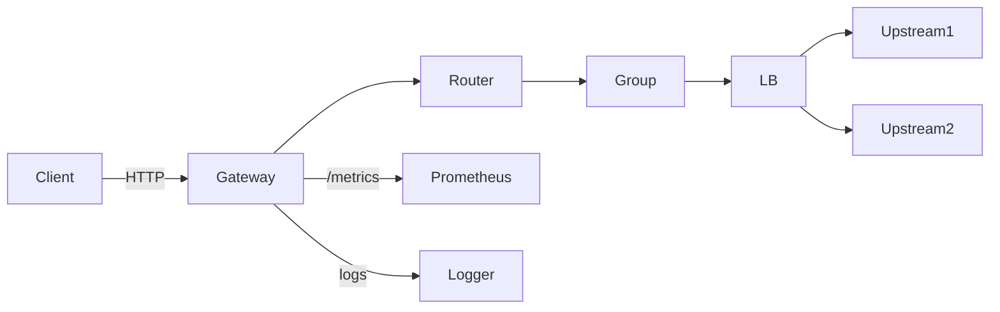
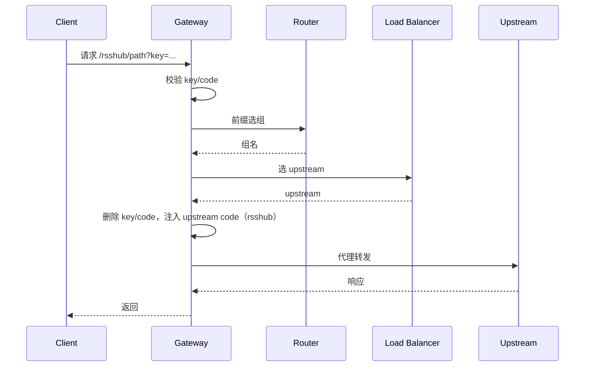

# RSSHub-Gateway

面向 RSSHub 多实例部署的轻量网关，并支持 Upvote RSS。保持 RSSHub 路由兼容，
同时提供路由分组、负载均衡、健康检查、可观测性与热更新，便于稳定上线与运维。

- 语言：Go
- 网络：Fiber + fasthttp
- 鉴权：网关 key/code + 上游 code 注入（仅 RSSHub）
- 可观测：Prometheus + pprof + JSON 日志

[English README](README.md)

## 功能亮点
- 多后端路由：`/rsshub/` -> RSSHub，`/upvote/` -> Upvote RSS
- 路由分组：按前缀 allow/deny，最长前缀优先
- 组内负载均衡：平滑加权轮询（WRR）或 hash(path)
- 网关鉴权：`?key=` 或 `?code=md5(path+key)`
- 上游注入：剥离客户端 key/code，仅 RSSHub 注入 upstream code
- 订阅缩写：`/short/{name}` 301 跳转并透传 query
- 健康检查 + 被动剔除 + 重试 + fallback
- Prometheus 指标（accesskey 保护）
- pprof 调试端点（accesskey 保护）
- JSON 结构化日志
- SIGHUP 热加载（失败回滚）

## 架构示意





## 快速开始

```bash
# 构建
make build

# 运行
./rsshub-gateway serve -c config.example.yaml
```

## Docker

```bash
docker build -t rsshub-gateway:latest .
docker run --rm -p 8080:8080 rsshub-gateway:latest
```

预构建镜像：
- `docker pull nerdneils/rsshub-gateway:latest`
- `docker pull ghcr.io/nerdneilsfield/rsshub-gateway:latest`

自定义配置文件：

```bash
docker run --rm -p 8080:8080 \
  -v "$(pwd)/config.example.yaml:/app/config.yaml:ro" \
  rsshub-gateway:latest \
  /app/rsshub-gateway serve -c /app/config.yaml
```

## 配置

完整配置见 `config.example.yaml`。

<details>
<summary>配置说明（折叠）</summary>

- `routing.default_group` 必须存在于 groups 中。
- allow/deny 使用前缀匹配，deny 优先，前缀需包含 `/`。
- `backend` 只能是 `rsshub` 或 `upvote`（默认 `rsshub`）。
- `strip_prefix` 用于转发前剥离服务前缀（如 `/rsshub`、`/upvote`）。
- `gateway_auth` 需要 `access_key`，且 `accept_key`/`accept_code` 至少开一个。
- upstream `access_key` 仅 RSSHub 用于 code 注入和健康检查 `?key=`。
- 健康检查使用 `path`、`interval_ms`、`timeout_ms`、`retries`。
- `failover.passive_eject` 要求 `base_eject_ms <= max_eject_ms`。
- 启用 metrics 时需要配置 `metrics.accesskey`。
- 启用 pprof 时需要配置 `pprof.accesskey`。
- 启用 short 时 `short.path` 必须以 `/` 开头，且 name 唯一。
</details>

<details>
<summary>完整配置示例</summary>

```yaml
server:
  listen: ":8080"
  timeout_ms: 8000

gateway_auth:
  enabled: true
  access_key: "ILoveRSSHub"
  accept_key: true
  accept_code: true

metrics:
  enabled: true
  path: "/metrics"
  accesskey: "PROM_KEY_123"

pprof:
  enabled: false
  path: "/debug/pprof"
  accesskey: "PPROF_KEY_123"

short:
  enabled: true
  path: "/short"
  entries:
    - name: "latepost"
      target: "/rsshub/latepost/4"
    - name: "reddit-top"
      target: "https://example.com/rss?platform=reddit"

routing:
  default_group: "rsshub-public"

failover:
  retry:
    enabled: true
    max_retries: 1
  passive_eject:
    enabled: true
    fail_threshold: 3
    base_eject_ms: 10000
    max_eject_ms: 60000

groups:
  - name: "rsshub-public"
    backend: "rsshub"
    strip_prefix: "/rsshub"
    priority: 10
    allow: ["/rsshub/"]
    deny: []
    lb:
      policy: "wrr"
    fallback_groups: ["rsshub-backup"]
    health:
      active:
        enabled: true
        path: "/healthz"
        interval_ms: 30000
        timeout_ms: 10000
        retries: 3
    upstreams:
      - url: "http://rsshub-1:1200"
        weight: 3
        access_key: "UP1KEY"
      - url: "http://rsshub-2:1200"
        weight: 2
        access_key: "UP2KEY"

  - name: "rsshub-backup"
    backend: "rsshub"
    strip_prefix: "/rsshub"
    priority: 1
    allow: ["/rsshub/"]
    deny: []
    lb:
      policy: "hash"
    upstreams:
      - url: "http://rsshub-b1:1200"
        weight: 1
        access_key: "B1KEY"

  - name: "upvote"
    backend: "upvote"
    strip_prefix: "/upvote"
    priority: 5
    allow: ["/upvote/"]
    deny: []
    lb:
      policy: "wrr"
    upstreams:
      - url: "http://upvote-rss:80"
        weight: 1
```
</details>

## 鉴权

网关支持两种访问方式：

```text
http://127.0.0.1:8080/rsshub/latepost/4?key=ACCESS_KEY
http://127.0.0.1:8080/rsshub/latepost/4?code=md5(path+ACCESS_KEY)
http://127.0.0.1:8080/upvote/?platform=reddit&key=ACCESS_KEY
```

迁移说明（code 方式）：
如果之前用 `?code=` 访问 `/latepost/...`，需要改成 `/rsshub/latepost/...`，
并按 `md5("/rsshub/latepost/4"+ACCESS_KEY)` 计算。key 方式不变。

上游注入规则：
- 删除客户端 `key` 与 `code`
- 仅 RSSHub 注入 `code=md5(path+upstream_access_key)`

## 订阅缩写

short 入口返回 301 并将原始 query 追加到目标 URL。

```text
GET /short/latepost?key=ACCESS_KEY
-> 301 Location: /rsshub/latepost/4?key=ACCESS_KEY

GET /short/reddit-top?code=ABC
-> 301 Location: https://example.com/rss?platform=reddit&code=ABC
```

## 路由与负载均衡

- allow/deny 前缀匹配，deny 优先
- 最长前缀优先，其次 priority，再按配置顺序
- 每组 `wrr` 或 `hash` 二选一
- 若配置 `strip_prefix`，转发前剥离服务前缀（如 `/rsshub` 或 `/upvote`）

## 健康检查

主动健康检查请求 `/healthz`。当 RSSHub 设置 `ACCESS_KEY` 时，健康检查会
自动追加 `?key=<upstream_access_key>`。

Docker Compose 建议：

```yaml
healthcheck:
  test: ["CMD", "curl", "-f", "http://localhost:1200/healthz?key=${ACCESS_KEY}"]
```

## 指标

访问方式（带 accesskey）：

```text
GET /metrics?accesskey=<METRICS_ACCESS_KEY>
```

<details>
<summary>指标列表</summary>

- rsshub_gateway_requests_total{method,group,route_prefix,status}
- rsshub_gateway_request_duration_seconds_bucket{group,route_prefix}
- rsshub_gateway_upstream_requests_total{group,upstream,status}
- rsshub_gateway_upstream_health{group,upstream}
- rsshub_gateway_upstream_eject_total{group,upstream}
- rsshub_gateway_retry_total{group}
- rsshub_gateway_fallback_total{from,to}
- rsshub_gateway_config_reload_total{result}
</details>

## pprof

访问方式（带 accesskey）：

```text
GET /debug/pprof/?accesskey=<PPROF_ACCESS_KEY>
```

## 日志

访问日志为 JSON，每请求一条；事件日志记录健康变更、剔除和重载等事件。

<details>
<summary>访问日志字段建议</summary>

- ts
- level
- req_id
- method
- path
- group
- upstream
- route_prefix
- status
- duration_ms
- retries
- fallback_chain
- err_type
- err
</details>

## 热加载

```bash
kill -HUP <pid>
```

## 开发

```bash
make test
make cover
```

## 发布

```bash
goreleaser release --snapshot --clean --skip-publish
```

## License

MIT
